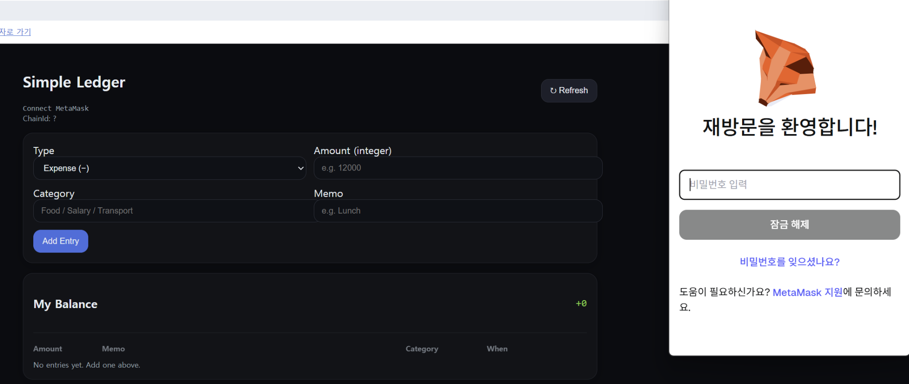

# Simple Ledger — 간단한 웹3 가계부 dApp

**Simple Ledger**는 메타마스크로 연결해 **수입(+) / 지출(–)** 내역을 온체인에 기록하는 **아주 단순한 dApp**입니다.  
테스트넷(예: **Sepolia**, `chainId = 11155111`)에서 동작하도록 구성되어 있습니다.

---

## 무엇을 할 수 있나요?

- 메타마스크 지갑 연결
- 항목 추가: **유형(수입/지출)**, **금액(정수)**, **카테고리**, **메모**
- 트랜잭션 확인 후 온체인에 기록
- **My Balance**에서 최근 항목과 합계 확인

---

## 사용 방법

1. 브라우저에서 dApp을 엽니다.
2. 메타마스크로 지갑을 **연결**합니다.
3. 폼에서 **유형, 금액, 카테고리, 메모**를 입력합니다.
4. **Add Entry** 버튼 클릭 → 메타마스크 팝업에서 **확인(Confirm)** 합니다.
5. 필요하면 **Refresh** 버튼으로 최신 상태를 불러옵니다.

> 메타마스크가 잠겨 있으면 비밀번호 입력창이 먼저 뜰 수 있어요.

---

## 필드 설명

| 필드 | 내용 | 예시 |
|---|---|---|
| **Type** | `Income (+)` 또는 `Expense (–)` | Expense (–) |
| **Amount** | **양의 정수**만 입력, 부호는 Type에 따라 적용 | 25000 |
| **Category** | 자유 입력 카테고리 | Food / Salary / Transport |
| **Memo** | 간단한 메모 | Lunch / good |

합계는 **수입 합 – 지출 합**으로 계산됩니다.

---

## 지갑 & 네트워크

- **지갑**: MetaMask (브라우저 확장)
- **네트워크**: Sepolia 테스트넷 (`11155111`)
- **수수료**: SepoliaETH가 필요합니다(테스트넷 파우셋 이용).

---
